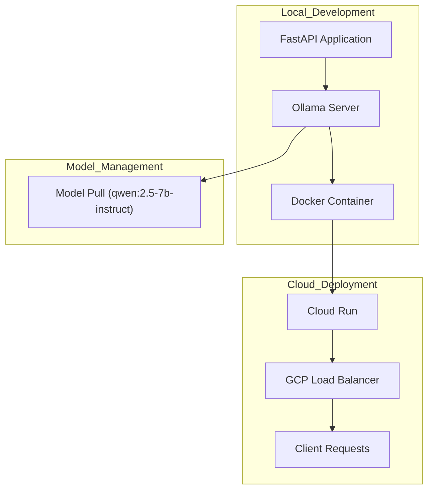

Voici un schéma Mermaid explicatif des flux et de l'architecture de votre projet FastAPI avec Ollama, déployé sur Google Cloud Run :

Ce schéma illustre les principaux composants et flux de votre architecture :

## Local Development
- Votre application FastAPI communique avec le serveur Ollama.
- Le serveur Ollama et l'application sont encapsulés dans un conteneur Docker.

## Cloud Deployment
- Le conteneur Docker est déployé sur Google Cloud Run.
- Un équilibreur de charge GCP gère les requêtes entrantes.
- Les clients envoient des requêtes à l'API via l'équilibreur de charge.

## Model Management
- Le serveur Ollama télécharge et gère le modèle LLM (qwen:2.5-7b-instruct).

Cette architecture permet une scalabilité efficace et une gestion simplifiée du déploiement, tout en offrant les performances nécessaires pour exécuter des modèles LLM via Ollama.